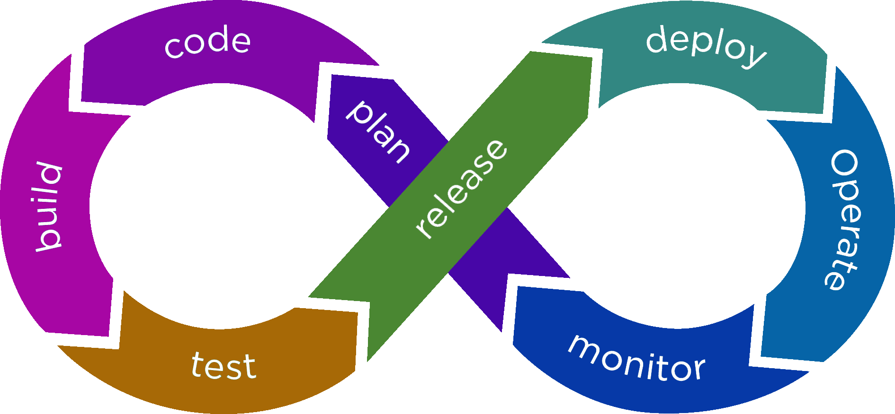

<!-- Logo 4noobs -->

  

<!-- Title -->

  <h2 align="center">DevOps</h2>

  <h1 align="center"></h1>
  
  

     
    <a href="#ROADMAP"><strong>Explore a documentação »</strong></a>
     
     
    <a href="link-para-abrir-issue">Report Bug</a>
    ·
    <a href="link-para-abrir-issue">Request Feature</a>
  

    
 <!-- ABOUT THE PROJECT -->

## Sobre o Repositório
Guia sobre DevOps para iniciantes, revelando os benefícios e vantagens de usar o DevOps para melhorar o desempenho dos projetos. O que o DevOps significa para as equipes? O DevOps permite que funções anteriormente isoladas – desenvolvimento, operações de TI, engenharia da qualidade e segurança – atuem de forma coordenada e colaborativa para gerar produtos melhores e mais confiáveis. Ao adotar uma cultura de DevOps em conjunto com as práticas e ferramentas de DevOps, as equipes ganham a capacidade de responder melhor às necessidades dos clientes, aumentar a confiança nos aplicativos que constroem e cumprir as metas empresariais mais rapidamente.

<!-- ROADMAP OF PROJECT -->

## Road Map

- [Introdução](contents/introdução/introdução.md)
- [Benefício](contents/beneficios/beneficios.md)
- [O ciclo de vida do aplicativo](contents/ciclodevida/ciclodevida.md)
  - [Plano](link)
  - [Desenvolver](link)
  - [Fornecimento](link)
  - [Operar](link)
- [Cultura DevOps](link)
- [Práticas](link)
- [Aprenda uma linguagem de programação/Escolha qualquer idioma para automação](link)
- [Entenda os diferentes conceitos de sistema operacional](link)
  - [Networking](link)
  - [POSIX](link)
  - [Sockets](link)
  - [Processos](link)
- [Saiba mais sobre o gerenciamento de servidores](link)
- [Rede, Segurança e Protocolos](link)
- [O que é e como configurar um...?](link)
  - [Reverse Proxy](link)
  - [Forward Proxy](link)
  - [Firewall](link)
  - [Caching Server](link)
  - [Load Balancer](link)
  - [Web Server](link)
- [Aprenda infraestrutura como código](link)
  - [Service Mesh](link)
  - [Containers](link)
  - [Configuration Mgmt.](link)
- [Aprenda alguma ferramenta de CI/CD](link)
- [Aprenda a monitorar software e infraestrutura](link)
  - [Monitoramento de Infraestrutura](link)
  - [Monitoramento de Aplicações](link)
- [Provedores de nuvem](link)
- [Padrões de design de nuvem](link)

<!-- CONTRIBUTING -->

## Como Contribuir

Contribuições fazem com que a comunidade open source seja um lugar incrível para aprender, inspirar e criar. Todas contribuições
são **extremamente apreciadas**

1. Realize um Fork do projeto
2. Crie um branch com a nova feature (`git checkout -b feature/feature`)
3. Realize o Commit (`git commit -m 'Adicionado conteudo'`)
4. Realize o Push no Branch (`git push origin feature/feature`)
5. Abra um Pull Request

## Autores

- **Lucas Barcat** - _Pós graduado em Projetos e Estudande de Engenharia de Computação_ - [@lucasbarcat](@LucasBarcat)

---

  

